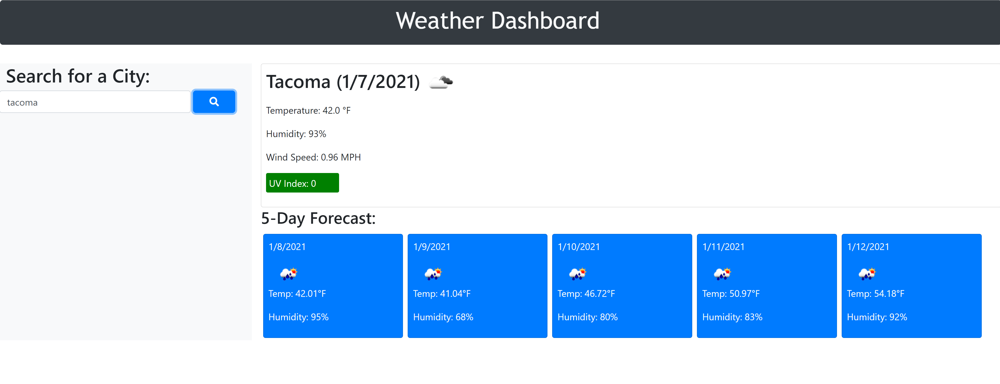

# WEATHER DASHBOARD

## Description

Displays current weather information, plus 5-day forecast for any given city.

## Table of Contents

* [Location](#location)

* [Usage](#usage)

* [Screenshot](#screenshot)

* [Demo](#demo)

* [Contact](#contact)

## Location

* [GitHub Repository](https://github.com/andrenajuric/weather-dashboard)

* [Live Page](https://andrenajuric.github.io/weather-dashboard/)

## Usage 

User must enter a city into the search bar on the right and upon clicking the search button, current weather information will display for that city as well as 5-days ahead. 

## Screenshot

## Demo

* [Live Demo](https://www.awesomescreenshot.com/video/2292143?key=033f2939d01a0e4cd090d8b1e828b9b4)

## Contact

You may contact me via email or GitHub with any inquiries.

* Email: ajuric.uw@gmail.com
* GitHub: andrenajuric